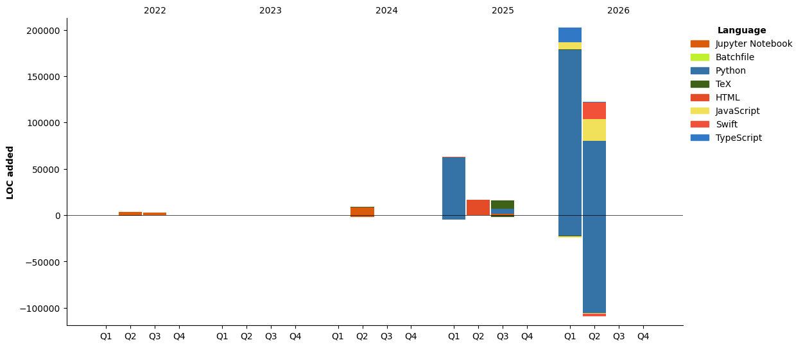

<h1 align="center">Hi, I'm Jinyang Wang 👋</h1>

<p align="center">
  Software developer based in the UAE · Early bird coder · Python &amp; mobile enthusiast
</p>

---

## About Me

- I work primarily in **Python** and **Jupyter Notebook** for data and ML projects
- Building mobile experiences with **Swift**, and web tooling with **JavaScript / TypeScript**
- Deepening expertise in **data science and ML pipelines**
- Most productive on **Friday mornings** — early 🐤 coding style
- Currently based in **Dubai, UAE** (UTC+4)

---

<p align="center">
  
</p>

---

## Tech Stack


---

## GitHub Stats

<p align="center">
  
  
</p>

---

## Coding Activity

<!--START_SECTION:waka-->


**I'm an Early 🐤** 

```text
🌞 Morning                355 commits         █████████░░░░░░░░░░░░░░░░   37.57 % 
🌆 Daytime                352 commits         █████████░░░░░░░░░░░░░░░░   37.25 % 
🌃 Evening                230 commits         ██████░░░░░░░░░░░░░░░░░░░   24.34 % 
🌙 Night                  8 commits           ░░░░░░░░░░░░░░░░░░░░░░░░░   00.85 % 
```
📅 **I'm Most Productive on Friday** 

```text
Monday                   123 commits         ███░░░░░░░░░░░░░░░░░░░░░░   13.02 % 
Tuesday                  152 commits         ████░░░░░░░░░░░░░░░░░░░░░   16.08 % 
Wednesday                201 commits         █████░░░░░░░░░░░░░░░░░░░░   21.27 % 
Thursday                 116 commits         ███░░░░░░░░░░░░░░░░░░░░░░   12.28 % 
Friday                   211 commits         ██████░░░░░░░░░░░░░░░░░░░   22.33 % 
Saturday                 79 commits          ██░░░░░░░░░░░░░░░░░░░░░░░   08.36 % 
Sunday                   63 commits          ██░░░░░░░░░░░░░░░░░░░░░░░   06.67 % 
```


📊 **This Week I Spent My Time On** 

```text
🕑︎ Time Zone: Asia/Dubai

💬 Programming Languages: 
No Activity Tracked This Week

💻 Operating System: 
No Activity Tracked This Week
```

**I Mostly Code in Python** 

```text
Python                   14 repos            ███████████░░░░░░░░░░░░░░   42.42 % 
Jupyter Notebook         8 repos             ██████░░░░░░░░░░░░░░░░░░░   24.24 % 
Swift                    3 repos             ██░░░░░░░░░░░░░░░░░░░░░░░   09.09 % 
JavaScript               2 repos             ██░░░░░░░░░░░░░░░░░░░░░░░   06.06 % 
TypeScript               1 repo              █░░░░░░░░░░░░░░░░░░░░░░░░   03.03 % 
```


 Last Updated on 09/04/2026 10:41:35 UTC
<!--END_SECTION:waka-->

---

## Contact Me

[](https://www.linkedin.com/in/jinyang-wang/)
[](mailto:jinyang.wang27@outlook.com)
